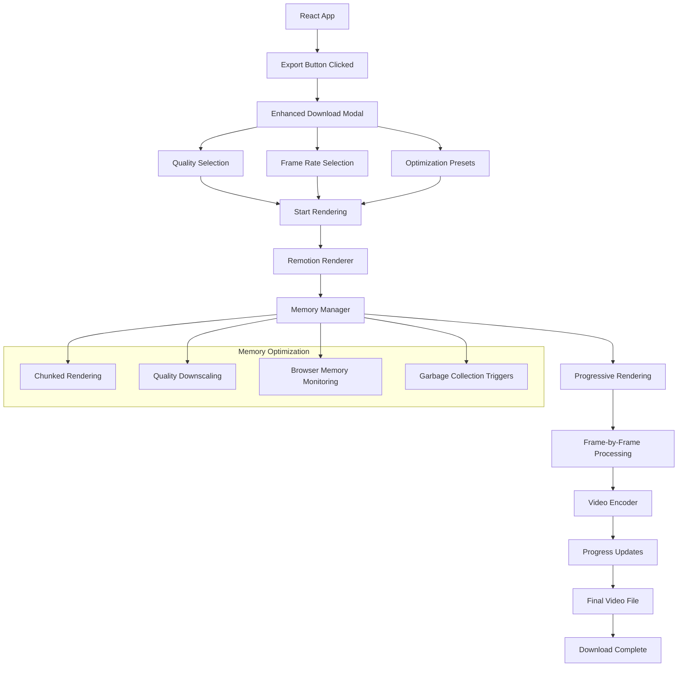

# Remotion Client-Side Rendering Implementation Plan

This document outlines the implementation plan for adding real video rendering capabilities to the React Video Editor project using Remotion's client-side rendering capabilities directly in the browser.

## Table of Contents

1. [Overview](#overview)
2. [Architecture](#architecture)
3. [User Interface](#user-interface)
4. [Implementation Details](#implementation-details)
5. [Memory Optimization](#memory-optimization)
6. [Implementation Timeline](#implementation-timeline)

## Overview

This approach leverages Remotion's built-in rendering capabilities to render videos directly in the browser without requiring external dependencies or server-side processing. While this approach has limitations for longer or more complex videos, it provides a seamless integration with the existing Remotion setup.

### Key Features

- Direct browser-based rendering using Remotion's APIs
- Support for Full HD (1080p) rendering with optimizations for 4K
- Memory-efficient processing techniques for browser environment
- User-configurable quality settings and frame rates
- Progressive rendering with cancelation support

### Pros and Cons

**Pros:**
- Integrated with existing Remotion setup
- No need for external dependencies or server setup
- Consistent rendering between preview and export
- Works across all platforms without installation requirements

**Cons:**
- Limited by browser capabilities and memory
- May struggle with complex compositions or 4K rendering
- Performance issues with longer videos
- Subject to browser tab crashes if memory limits are exceeded
## Architecture



## User Interface

### Enhanced Quality Configuration UI

The download modal will include quality settings optimized for browser-based rendering:

1. **Resolution Selection**
   - HD (720p) - Memory efficient
   - Full HD (1080p) - Standard quality
   - 4K (2160p) - Limited support, with warnings
   - Custom resolution

2. **Frame Rate Options**
   - 30 FPS (YouTube standard)
   - 60 FPS (Smooth motion)
   - 24 FPS (Cinematic)
   - Custom FPS

3. **Quality vs Performance Slider**
   - Higher quality (more memory usage)
   - Balanced
   - Performance focused (less memory usage)

4. **Memory Usage Estimator**
   - Shows estimated memory requirements
   - Warns if settings may exceed browser capabilities
   - Suggests optimal settings based on detected browser memory
### Modern UI Components

```jsx
// Resolution presets optimized for browser rendering
const BROWSER_RESOLUTION_PRESETS = [
  {
    id: 'hd',
    name: 'HD (720p)',
    width: 1280,
    height: 720,
    description: 'Memory efficient, good for longer videos',
    icon: 'hd',
    memoryMultiplier: 1
  },
  {
    id: 'fullhd',
    name: 'Full HD (1080p)',
    width: 1920,
    height: 1080,
    description: 'Standard high-definition format',
    icon: 'hd',
    memoryMultiplier: 2.25
  },
  {
    id: '4k',
    name: '4K (2160p)',
    width: 3840,
    height: 2160,
    description: 'Ultra HD (may exceed browser memory)',
    icon: '4k',
    memoryMultiplier: 9,
    warning: 'May cause browser crashes with longer videos'
  },
  {
    id: 'custom',
    name: 'Custom Resolution',
    width: null,
    height: null,
    description: 'Specify your own dimensions',
    icon: 'settings',
    memoryMultiplier: null
  }
];

// Quality presets for browser rendering
const BROWSER_QUALITY_PRESETS = [
  {
    id: 'performance',
    name: 'Performance',
    description: 'Optimized for longer videos, uses less memory',
    encodingParams: {
      bitrate: {
        hd: '5M',
        fullhd: '8M',
        '4k': '16M'
      },
      quality: 0.7
    }
  },
  {
    id: 'balanced',
    name: 'Balanced',
    description: 'Good balance between quality and performance',
    encodingParams: {
      bitrate: {
        hd: '8M',
        fullhd: '12M',
        '4k': '25M'
      },
      quality: 0.85
    }
  },
  {
    id: 'quality',
    name: 'High Quality',
    description: 'Best quality, requires more memory',
    encodingParams: {
      bitrate: {
        hd: '12M',
        fullhd: '20M',
        '4k': '40M'
      },
      quality: 0.95
    }
  }
];

// Frame rate presets
const BROWSER_FRAME_RATE_PRESETS = [
  {
    id: 'youtube-standard',
    fps: 30,
    name: '30 FPS',
    description: 'Standard for most YouTube content'
  },
  {
    id: 'youtube-smooth',
    fps: 60,
    name: '60 FPS',
    description: 'Smooth motion for action videos'
  },
  {
    id: 'cinema',
    fps: 24,
    name: '24 FPS',
    description: 'Film-like cinematic look'
  },
  {
    id: 'custom',
    fps: null,
    name: 'Custom FPS',
    description: 'Specify your own frame rate'
  }
];
```

## Implementation Details

### 1. Browser Memory Detection

```javascript
// Detect available browser memory
const detectBrowserMemory = () => {
  // Use performance.memory if available (Chrome)
  if (performance && 'memory' in performance) {
    const { jsHeapSizeLimit, totalJSHeapSize, usedJSHeapSize } = performance.memory;
    
    return {
      total: Math.round(jsHeapSizeLimit / (1024 * 1024)),
      used: Math.round(usedJSHeapSize / (1024 * 1024)),
### 2. Chunked Rendering Implementation

```javascript
// Implement chunked rendering to manage memory
const renderInChunks = async (composition, options) => {
  const { fps, duration, width, height, quality, onProgress } = options;
  const totalFrames = Math.ceil((duration / 1000) * fps);
  
  // Determine optimal chunk size based on available memory
  const memoryInfo = detectBrowserMemory();
  const memoryEstimate = estimateMemoryRequirements({ width, height }, duration, fps);
  
  // Calculate frames per chunk based on available memory
  // Use a conservative approach to avoid browser crashes
  let framesPerChunk = 30; // Default
  
  if (memoryInfo.available) {
    // If we can detect available memory, use it to calculate chunk size
    // Use only 70% of available memory to be safe
    const safeMemoryMB = memoryInfo.available * 0.7;
    const memoryPerFrameMB = memoryEstimate.rawFrameMemoryMB / totalFrames;
    framesPerChunk = Math.max(10, Math.floor(safeMemoryMB / memoryPerFrameMB));
  } else {
    // If we can't detect memory, use resolution to estimate
    if (width >= 3840) { // 4K
      framesPerChunk = 15;
    } else if (width >= 1920) { // 1080p
      framesPerChunk = 30;
    } else {
      framesPerChunk = 60;
    }
  }
  
  // Calculate number of chunks
  const chunks = Math.ceil(totalFrames / framesPerChunk);
  
  // Initialize video encoder
  const encoder = new VideoEncoder({
    width,
    height,
    fps,
    bitrate: quality.encodingParams.bitrate[getResolutionKey(width, height)]
  });
  
  // Process each chunk
  for (let i = 0; i < chunks; i++) {
    const startFrame = i * framesPerChunk;
    const endFrame = Math.min((i + 1) * framesPerChunk - 1, totalFrames - 1);
    
    // Render frames for this chunk
    const frames = await renderFrameRange(composition, {
      startFrame,
      endFrame,
      fps,
      width,
      height,
      quality: quality.encodingParams.quality
    });
    
    // Add frames to encoder
    for (const frame of frames) {
      await encoder.addFrame(frame);
    }
    
    // Force garbage collection if possible
    if (window.gc) {
      window.gc();
    } else {
      // Alternative approach to encourage garbage collection
      const memoryHog = [];
      for (let j = 0; j < 1000000; j++) {
        memoryHog.push(j);
      }
      memoryHog.length = 0;
    }
    
    // Update progress
    const progress = Math.round(((i + 1) / chunks) * 100);
    onProgress({
      phase: 'rendering',
      progress,
      currentChunk: i + 1,
      totalChunks: chunks
    });
  }
  
  // Finalize encoding
  const videoBlob = await encoder.finalize();
  return videoBlob;
};
```

### 3. Remotion Integration

```javascript
// Integrate with Remotion's rendering APIs
const renderWithRemotion = async (design, options, onProgress) => {
  try {
    const { width, height, fps, quality } = options;
    
    // Create a composition config
    const compositionConfig = {
      width,
      height,
      fps,
      durationInFrames: Math.ceil((design.duration / 1000) * fps),
      id: 'main-composition'
    };
    
    // Initialize Remotion renderer
    const renderer = new Remotion.Renderer(compositionConfig);
    
    // Set up the composition
    renderer.setComponent(Composition, { design });
    
    // Render in chunks to manage memory
    const videoBlob = await renderInChunks(renderer, {
      fps,
      duration: design.duration,
      width,
      height,
      quality,
      onProgress
    });
    
    return {
      success: true,
      videoBlob,
      url: URL.createObjectURL(videoBlob)
    };
  } catch (error) {
    console.error('Error rendering with Remotion:', error);
    return {
      success: false,
      error: error.message
    };
  }
};
```

## Memory Optimization

### 1. Browser Memory Management

```javascript
// Monitor browser memory during rendering
const monitorBrowserMemory = (warningThresholdPercent = 80, criticalThresholdPercent = 90) => {
  if (!performance || !('memory' in performance)) {
    return {
      startMonitoring: () => {},
      stopMonitoring: () => {}
    };
  }
  
  let intervalId = null;
  let onWarning = null;
  let onCritical = null;
  
  const checkMemory = () => {
    const { jsHeapSizeLimit, usedJSHeapSize } = performance.memory;
    const usedPercent = (usedJSHeapSize / jsHeapSizeLimit) * 100;
    
    if (usedPercent >= criticalThresholdPercent && onCritical) {
      onCritical(usedPercent);
    } else if (usedPercent >= warningThresholdPercent && onWarning) {
      onWarning(usedPercent);
    }
  };
  
  return {
    startMonitoring: (options = {}) => {
      onWarning = options.onWarning;
      onCritical = options.onCritical;
      intervalId = setInterval(checkMemory, 1000);
    },
    stopMonitoring: () => {
      if (intervalId) {
        clearInterval(intervalId);
        intervalId = null;
      }
    }
  };
};
```

### 2. Quality Downscaling for Memory Constraints

```javascript
// Dynamically adjust quality based on memory constraints
const adjustQualityForMemory = (initialOptions) => {
  const memoryInfo = detectBrowserMemory();
  const memoryEstimate = estimateMemoryRequirements(
    { width: initialOptions.width, height: initialOptions.height },
    initialOptions.duration,
    initialOptions.fps
  );
  
  // If we can't detect memory or have enough, return original options
  if (!memoryInfo.available || memoryEstimate.totalEstimatedMemoryMB < memoryInfo.available * 0.7) {
    return initialOptions;
  }
  
  // We need to adjust quality to fit in memory
  const adjustedOptions = { ...initialOptions };
  
  // Try reducing quality first
  if (initialOptions.quality.id === 'quality') {
    adjustedOptions.quality = BROWSER_QUALITY_PRESETS.find(p => p.id === 'balanced');
  } else if (initialOptions.quality.id === 'balanced') {
    adjustedOptions.quality = BROWSER_QUALITY_PRESETS.find(p => p.id === 'performance');
  }
  
  // If still not enough, reduce resolution
  if (memoryEstimate.totalEstimatedMemoryMB > memoryInfo.available * 0.7) {
    if (initialOptions.width >= 3840) { // 4K
      adjustedOptions.width = 1920;
      adjustedOptions.height = 1080;
    } else if (initialOptions.width >= 1920) { // 1080p
      adjustedOptions.width = 1280;
      adjustedOptions.height = 720;
    }
  }
  
  return adjustedOptions;
};
```

## Implementation Timeline

### Week 1: Browser Rendering Setup
- Implement browser memory detection
- Create enhanced download modal with quality settings
- Set up memory monitoring

### Week 2: Chunked Rendering Implementation
- Implement frame-by-frame rendering
- Create chunked processing pipeline
- Set up memory-aware quality adjustments

### Week 3: Video Encoding Integration
- Implement browser-based video encoding
- Create progress tracking system
- Set up error handling and recovery

### Week 4: Frontend Integration and Testing
- Integrate UI with rendering pipeline
- Test on various browsers and devices
- Optimize for different content types

### Week 5: Optimization and Finalization
- Fine-tune quality parameters
- Implement advanced memory management
- Add fallback mechanisms for browser limitations

## Conclusion

This implementation plan provides a browser-based approach to video rendering using Remotion's client-side capabilities. While this approach has limitations for longer or more complex videos, it offers a seamless integration with the existing Remotion setup without requiring external dependencies or server-side processing.

The memory-aware rendering pipeline with chunked processing and quality adjustments will help maximize the capabilities of the browser environment while providing users with high-quality video output for their projects.
      available: Math.round((jsHeapSizeLimit - usedJSHeapSize) / (1024 * 1024))
    };
  }
  
  // Fallback for browsers without memory API
  return {
    total: navigator.deviceMemory ? navigator.deviceMemory * 1024 : 4096, // Estimate based on deviceMemory or assume 4GB
    used: null,
    available: null
  };
};

// Estimate memory requirements for rendering
const estimateMemoryRequirements = (resolution, duration, fps) => {
  // Calculate number of frames
  const totalFrames = Math.ceil((duration / 1000) * fps);
  
  // Estimate memory per frame (width * height * 4 bytes for RGBA)
  const bytesPerFrame = resolution.width * resolution.height * 4;
  
  // Total raw frame memory (MB)
  const rawFrameMemoryMB = Math.round((bytesPerFrame * totalFrames) / (1024 * 1024));
  
  // Add overhead for encoding, audio, and Remotion
  const totalEstimatedMemoryMB = Math.round(rawFrameMemoryMB * 1.5);
  
  return {
    rawFrameMemoryMB,
    totalEstimatedMemoryMB,
    framesPerSecond: fps,
    totalFrames
  };
};