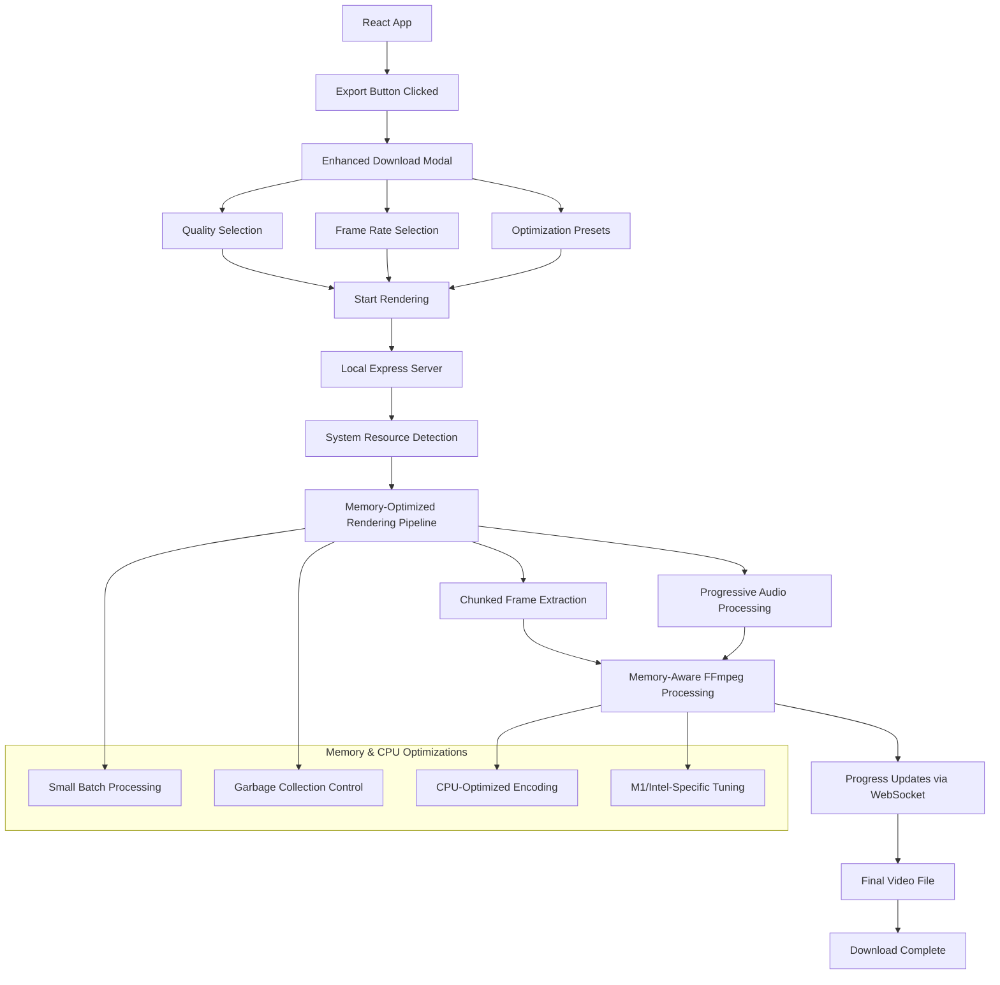

# Real Video Rendering Implementation Plan

This document outlines the implementation plan for adding real video rendering capabilities to the React Video Editor project, replacing the current mock implementation with a high-quality, memory-efficient solution that works well on systems with limited resources.

## Table of Contents

1. [Overview](#overview)
2. [Architecture](#architecture)
3. [User Interface](#user-interface)
4. [Backend Implementation](#backend-implementation)
5. [System-Specific Optimizations](#system-specific-optimizations)
6. [Implementation Timeline](#implementation-timeline)

## Overview

The goal is to implement real video rendering with the following key features:

- Support for Full HD (1080p) and 4K (2160p) rendering
- Memory-efficient processing for systems with limited RAM (8GB M1 MacBook)
- CPU-optimized encoding for systems without dedicated GPUs
- User-configurable quality settings and frame rates
- Platform-optimized presets (YouTube, etc.)

## Architecture



## User Interface

### Enhanced Quality Configuration UI

The download modal will be enhanced with modern quality settings:

1. **Resolution Selection**
   - Full HD (1080p)
   - 2K (1440p)
   - 4K (2160p)
   - Custom resolution

2. **Frame Rate Options**
   - 30 FPS (YouTube standard)
   - 60 FPS (Smooth motion)
   - 24 FPS (Cinematic)
   - Custom FPS

3. **Content Type Optimization**
   - General
   - Animation
   - Screen Recording
   - High Motion

### Modern UI Components

```jsx
// Resolution presets
const RESOLUTION_PRESETS = [
  {
    id: 'fullhd',
    name: 'Full HD (1080p)',
    width: 1920,
    height: 1080,
    description: 'Standard high-definition format',
    icon: 'hd'
  },
  {
    id: '2k',
    name: '2K (1440p)',
    width: 2560,
    height: 1440,
    description: 'Quad HD format for higher detail',
    icon: 'hd-plus'
  },
  {
    id: '4k',
    name: '4K (2160p)',
    width: 3840,
    height: 2160,
    description: 'Ultra HD for maximum quality',
    icon: '4k'
  },
  {
    id: 'custom',
    name: 'Custom Resolution',
    width: null,
    height: null,
    description: 'Specify your own dimensions',
    icon: 'settings'
  }
];

// Frame rate presets
const FRAME_RATE_PRESETS = [
  {
    id: 'youtube-standard',
    fps: 30,
    name: '30 FPS',
    description: 'Standard for most YouTube content'
  },
  {
    id: 'youtube-smooth',
    fps: 60,
    name: '60 FPS',
    description: 'Smooth motion for action videos'
  },
  {
    id: 'cinema',
    fps: 24,
    name: '24 FPS',
    description: 'Film-like cinematic look'
  },
  {
    id: 'custom',
    fps: null,
    name: 'Custom FPS',
    description: 'Specify your own frame rate'
  }
];

// Content type presets
const CONTENT_TYPE_PRESETS = [
  {
    id: 'general',
    name: 'General',
    description: 'Balanced settings for most content',
    encodingParams: {
      crf: 20,
      preset: 'medium',
      tune: 'film'
    }
  },
  {
    id: 'animation',
    name: 'Animation',
    description: 'Optimized for animated content',
    encodingParams: {
      crf: 18,
      preset: 'medium',
      tune: 'animation'
    }
  },
  {
    id: 'screen-recording',
    name: 'Screen Recording',
    description: 'Best for tutorials and demos',
    encodingParams: {
      crf: 18,
      preset: 'medium',
      tune: 'screen'
    }
  },
  {
    id: 'high-motion',
    name: 'High Motion',
    description: 'For sports and action videos',
    encodingParams: {
      crf: 22,
      preset: 'medium',
      tune: 'film',
      x264Params: 'rc-lookahead=60:ref=6'
    }
  }
];
```

## Backend Implementation

### 1. Local Express Server Setup

```
server/
├── index.js                # Main server file
├── package.json            # Server dependencies
├── renderer/               # Rendering logic
│   ├── extract.js          # Memory-efficient frame extraction
│   ├── encode.js           # System-specific FFmpeg encoding
│   └── progress.js         # Progress tracking
├── system/                 # System detection
│   ├── memory.js           # Memory monitoring
│   ├── cpu.js              # CPU detection (M1 vs Intel)
│   └── resources.js        # Resource allocation
├── utils/                  # Utility functions
└── temp/                   # Temporary files directory
```

### 2. System Detection

```javascript
// Detect system architecture and capabilities
const detectSystem = async () => {
  try {
    // Check if running on ARM (M1/M2 Mac)
    const isArm = process.arch === 'arm64';
    
    // Get total system memory
    const totalMemoryMB = Math.round(os.totalmem() / 1024 / 1024);
    
    // Check for Intel QuickSync availability
    let hasQuickSync = false;
    if (!isArm) {
      try {
        const { stdout } = await exec('ffmpeg -hwaccels');
        hasQuickSync = stdout.includes('qsv');
      } catch (e) {
        // Ignore errors, assume no QuickSync
      }
    }
    
    // Check for VideoToolbox (macOS)
    let hasVideoToolbox = false;
    try {
      const { stdout } = await exec('ffmpeg -hwaccels');
      hasVideoToolbox = stdout.includes('videotoolbox');
    } catch (e) {
      // Ignore errors, assume no VideoToolbox
    }
    
    return {
      isArm,
      totalMemoryMB,
      hasQuickSync,
      hasVideoToolbox,
      isMemoryConstrained: totalMemoryMB <= 8192
    };
  } catch (error) {
    console.error('Failed to detect system capabilities:', error);
    // Return conservative defaults
    return {
      isArm: false,
      totalMemoryMB: 8192, // Assume 8GB
      hasQuickSync: false,
      hasVideoToolbox: false,
      isMemoryConstrained: true
    };
  }
};
```

### 3. Memory-Efficient Frame Extraction

```javascript
// Extract frames in tiny batches to manage memory
const extractFramesMemoryEfficient = async (composition, options, systemInfo) => {
  const { fps, duration, width, height, jobId } = options;
  const totalFrames = Math.ceil((duration / 1000) * fps);
  
  // Determine batch size based on available memory
  const batchSize = systemInfo.isMemoryConstrained ? 15 : 30;
  const chunks = Math.ceil(totalFrames / batchSize);
  
  // Use lower quality JPEG for frame storage to save memory
  const outputFormat = 'jpeg';
  const jpegQuality = 90; // High quality but not lossless
  
  for (let i = 0; i < chunks; i++) {
    const startFrame = i * batchSize;
    const endFrame = Math.min((i + 1) * batchSize - 1, totalFrames - 1);
    
    // Extract frames with memory-efficient settings
    await renderFrameRange(composition, {
      startFrame,
      endFrame,
      fps,
      outputDir: `./temp/${jobId}/frames`,
      width,
      height,
      outputFormat,
      jpegQuality,
      concurrency: systemInfo.isMemoryConstrained ? 1 : 2 // Limit concurrency
    });
    
    // Force garbage collection after each batch
    if (global.gc) {
      global.gc();
    }
    
    // Update progress
    const progress = Math.round((endFrame / totalFrames) * 50); // 0-50% for extraction
    io.emit('progress', { 
      jobId, 
      phase: 'extraction', 
      progress,
      memoryUsage: monitorMemory()
    });
  }
};
```

### 4. System-Specific FFmpeg Commands

#### M1 Mac Optimization

```javascript
// For M1 Macs
const getM1OptimizedCommand = (options) => {
  const { quality, fps, jobId } = options;
  
  // Use videotoolbox hardware acceleration on M1
  const hwAccel = `-hwaccel videotoolbox`;
  
  // For 4K, be more conservative with bitrate
  const encoderOptions = quality === '4K (2160p)'
    ? `-c:v h264_videotoolbox -b:v 30M -maxrate 35M -bufsize 60M`
    : `-c:v h264_videotoolbox -b:v 15M -maxrate 20M -bufsize 30M`;
  
  return `ffmpeg ${hwAccel} -r ${fps} -i "./temp/${jobId}/frames/%04d.jpg" -i "./temp/${jobId}/audio.wav" ${encoderOptions} -pix_fmt yuv420p -c:a aac -b:a 256k -movflags +faststart -y "./temp/${jobId}/output.mp4"`;
};
```

#### Intel Integrated Graphics Optimization

```javascript
// For Intel systems with integrated graphics
const getIntelOptimizedCommand = (options) => {
  const { quality, fps, jobId } = options;
  
  // Try to use QSV but with conservative settings
  const hwAccel = `-hwaccel qsv -qsv_device /dev/dri/renderD128`;
  
  // For 4K, be very conservative with memory usage
  const encoderOptions = quality === '4K (2160p)'
    ? `-c:v h264_qsv -global_quality 23 -preset medium`
    : `-c:v h264_qsv -global_quality 21 -preset medium`;
  
  return `ffmpeg ${hwAccel} -r ${fps} -i "./temp/${jobId}/frames/%04d.jpg" -i "./temp/${jobId}/audio.wav" ${encoderOptions} -pix_fmt nv12 -c:a aac -b:a 256k -movflags +faststart -y "./temp/${jobId}/output.mp4"`;
};
```

#### CPU Fallback

```javascript
// Fallback for any system when hardware acceleration fails
const getCpuOptimizedCommand = (options) => {
  const { quality, fps, jobId } = options;
  
  // Use slower preset for better quality/compression ratio
  const encoderOptions = quality === '4K (2160p)'
    ? `-c:v libx264 -preset slower -crf 22 -tune film`
    : `-c:v libx264 -preset slower -crf 20 -tune film`;
  
  return `ffmpeg -r ${fps} -i "./temp/${jobId}/frames/%04d.jpg" -i "./temp/${jobId}/audio.wav" ${encoderOptions} -pix_fmt yuv420p -c:a aac -b:a 256k -movflags +faststart -y "./temp/${jobId}/output.mp4"`;
};
```

### 5. Memory Monitoring

```javascript
const monitorMemory = () => {
  const memoryUsage = process.memoryUsage();
  const usedMemoryMB = Math.round(memoryUsage.heapUsed / 1024 / 1024);
  const totalMemoryMB = Math.round(memoryUsage.heapTotal / 1024 / 1024);
  
  // If using more than 70% of available heap, trigger GC
  if (usedMemoryMB > totalMemoryMB * 0.7) {
    if (global.gc) {
      global.gc();
      console.log('Forced garbage collection');
    }
  }
  
  return {
    used: usedMemoryMB,
    total: totalMemoryMB,
    percentage: Math.round((usedMemoryMB / totalMemoryMB) * 100)
  };
};
```

### 6. Quality Settings Processing

```javascript
// Process quality settings on the server side
const processQualitySettings = (settings, systemInfo) => {
  const { resolution, fps, encodingParams } = settings;
  
  // Determine if this is a high-resolution render
  const isHighRes = resolution.height >= 1440;
  
  // Adjust batch size based on resolution and system memory
  let batchSize = 30; // Default
  
  if (isHighRes && systemInfo.isMemoryConstrained) {
    batchSize = 10; // Very small batches for 4K on 8GB systems
  } else if (isHighRes) {
    batchSize = 20; // Small batches for 4K on better systems
  } else if (systemInfo.isMemoryConstrained) {
    batchSize = 20; // Small batches for 1080p on 8GB systems
  }
  
  // Determine optimal FFmpeg parameters based on content type and system
  let ffmpegParams = {
    ...encodingParams,
    fps
  };
  
  // Adjust parameters for memory-constrained systems
  if (systemInfo.isMemoryConstrained) {
    // Use more memory-efficient settings
    ffmpegParams.preset = 'medium'; // Less memory-intensive than 'slower'
    
    // For 4K on memory-constrained systems, use 2-pass encoding
    if (isHighRes) {
      ffmpegParams.twoPass = true;
    }
  }
  
  return {
    batchSize,
    ffmpegParams,
    resolution,
    fps
  };
};
```

### 7. Two-Pass Encoding for 4K

```javascript
// Implement two-pass encoding for high-quality 4K rendering
const performTwoPassEncoding = async (settings, systemInfo, jobId) => {
  const { resolution, fps, ffmpegParams } = settings;
  const { crf, preset, tune } = ffmpegParams;
  
  // Base input options
  const inputOptions = `-r ${fps} -i "./temp/${jobId}/frames/%04d.jpg" -i "./temp/${jobId}/audio.wav"`;
  
  // Video codec options (using CPU encoding for best quality)
  const videoCodec = `-c:v libx264 -preset ${preset} -crf ${crf} -tune ${tune}`;
  
  // First pass - analyze video
  const firstPassCmd = `ffmpeg ${inputOptions} ${videoCodec} -pass 1 -an -f null /dev/null`;
  
  // Second pass - encode with analysis data
  const secondPassCmd = `ffmpeg ${inputOptions} ${videoCodec} -pass 2 -c:a aac -b:a 320k -pix_fmt yuv420p -movflags +faststart -y "./temp/${jobId}/output.mp4"`;
  
  // Execute first pass
  console.log('Starting first pass encoding...');
  await executeFFmpeg(firstPassCmd, jobId, 50, 75); // 50-75% progress
  
  // Execute second pass
  console.log('Starting second pass encoding...');
  await executeFFmpeg(secondPassCmd, jobId, 75, 100); // 75-100% progress
  
  return `./temp/${jobId}/output.mp4`;
};
```

## System-Specific Optimizations

### M1 Mac with 8GB RAM

1. **Memory Management**
   - Very small batch sizes (10-15 frames)
   - Aggressive garbage collection
   - JPEG frame storage instead of PNG

2. **VideoToolbox Acceleration**
   - Use h264_videotoolbox encoder
   - Conservative bitrates to avoid memory pressure
   - Optimized for ARM architecture

3. **Processing Pipeline**
   - Single-threaded frame extraction
   - Clean up frames immediately after encoding
   - Monitor memory usage and throttle if needed

### Intel i7 with Integrated Graphics

1. **QuickSync Integration**
   - Use h264_qsv encoder when available
   - Fall back to CPU encoding if QSV fails
   - Optimize for integrated graphics memory sharing

2. **CPU Optimization**
   - Use medium preset for better performance
   - Implement two-pass encoding for 4K
   - Tune parameters for integrated graphics

3. **Memory Efficiency**
   - Small batch sizes (20-30 frames)
   - Monitor system memory usage
   - Implement checkpointing for recovery

## Implementation Timeline

### Week 1: Modern UI and Server Setup
- Create enhanced download modal with quality settings
- Implement system detection
- Set up memory monitoring

### Week 2: User Configuration Processing
- Implement quality settings processing
- Create memory-efficient frame extraction
- Set up configuration validation

### Week 3: Advanced FFmpeg Integration
- Implement platform-optimized encoding presets
- Create system-specific processing pipelines
- Set up two-pass encoding for 4K

### Week 4: Frontend Integration and Testing
- Integrate UI with backend processing
- Test on both M1 and Intel systems
- Optimize for different content types

### Week 5: Quality Optimization and Finalization
- Fine-tune quality parameters
- Optimize memory usage
- Implement advanced error handling

## Conclusion

This implementation plan provides a comprehensive approach to adding real video rendering capabilities to the React Video Editor project. By focusing on memory efficiency and quality, the solution will work well on systems with limited resources while still producing high-quality output in both 1080p and 4K resolutions.

The user-friendly configuration interface with modern quality settings and frame rate options will make it easy for users to customize their rendering settings based on their specific needs and target platforms.